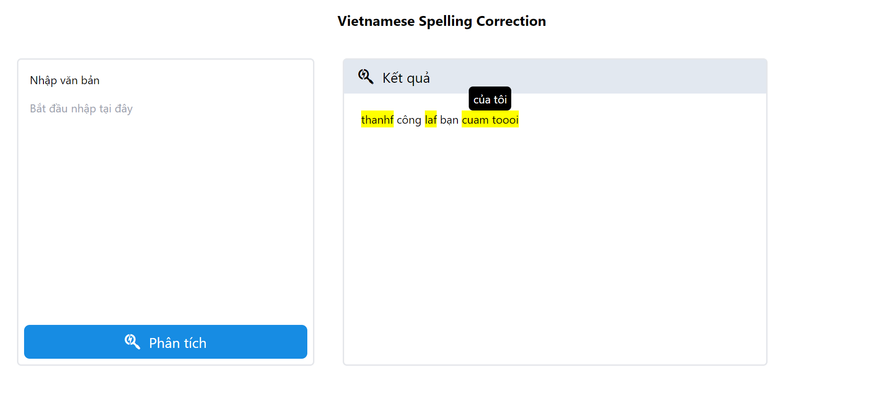

# VNSpellCorrection

## Environment setup using Conda
```
conda create -n spcr python=3.9.5
conda activate spcr
```
Install libraries
```
pip install -r requirements.txt
```

## To Use Our Trained Model

Download the following `vocab` and `weights` file

[binhvq.vocab.pkl](https://drive.google.com/file/d/1h4tu92zBj-ZELCH6lKNm2Ls-rtdIBx7l/view?usp=sharing)

[binhvq.weights.pth](https://drive.google.com/file/d/1NvbEfBkEr5-MSDHH8ERNNML40ADYaBAM/view?usp=sharing)

Set up folder **data** as follow

    .
    ├── ...
    ├── models
    ├── data                    
    │   ├── binhvq  
    │       └── binhvq.vocab.pkl        
    │   ├── checkpoints  
    │       └── tfmwtr
    │           └── binhvq.weights.pth         
	├── utils                       
    └── ...

And then start the `Flask` server
```
python server.py
```
Go to [localhost:8000](localhost:8000) to use the website



## To Train Model From Scratch

Prepare a corpus file `corpus.txt` and put as folowing structure. Sample file in the folder `sample`.

    .
    ├── ...
    ├── models
    ├── data                    
    │   ├── binhvq  
    │       └── corpus.txt               
	├── utils                       
    └── ...

Start prepare data by 
```
cd dataset
python prepare_dataset.py --corpus binhvq --file corpus.txt
cleandata.sh binhvq
```
Start training by
```
python train.py
```
## To Evaluate Model
Evaluate on generated dataset.
```
python correct.py
```
Evaluate on VSEC public dataset. First need to download `VSEC.jsonl` at https://github.com/VSEC2021/VSEC and setup folder as follow

    .
    ├── ...
    ├── models
    ├── data                    
    │   ├── vsec  
    │       └── VSEC.jsonl             
	├── utils                       
    └── ...

Start prepare VSEC data.
```
cd dataset
python prepare_vsec.py
```

```
python correct.py --test_data vsec
```


